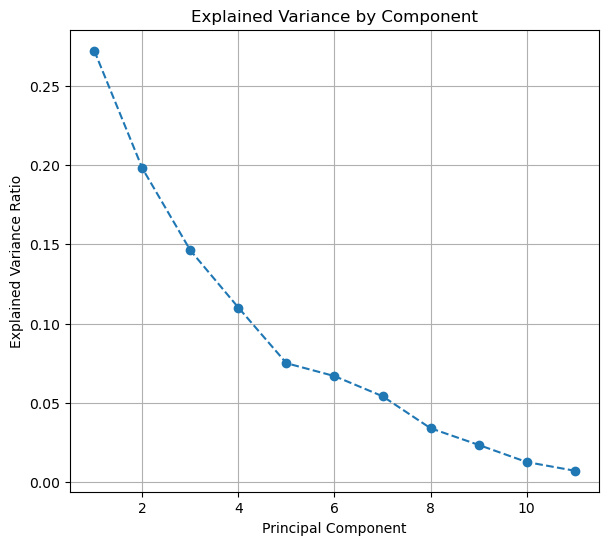

# Red Wine Quality Prediction with PCA 🍷

## Overview

This project explores the prediction of red wine quality based on its physicochemical properties. It involves data preprocessing, dimensionality reduction using Principal Component Analysis (PCA), and training classification models. A simple web interface is built using Gradio to interact with the trained model.

## Dataset

The dataset used is `winequality-red.csv`, which contains information about various physicochemical tests of red wines and a quality score (typically ranging from 3 to 8).


---
## APP:https://huggingface.co/spaces/venmugilrajan/Wine_Quality_PCA
## Explained Variance by Component

## Files in this Repository

* **`code.ipynb`**: Jupyter Notebook containing the data loading, exploratory data analysis (EDA), preprocessing steps (skew correction, outlier removal, scaling), PCA implementation, and model training (Logistic Regression, Random Forest).
* **`app.py`**: Python script using Gradio to create a web interface for predicting wine quality. It loads the saved preprocessors and the trained Random Forest model.
* **`requirements.txt`**: Lists the necessary Python libraries required to run the project.
* **`power_transformer.pkl`**: Saved fitted PowerTransformer object (using joblib).
* **`scaler.pkl`**: Saved fitted StandardScaler object (using joblib).
* **`pca_5_components.pkl`**: Saved fitted PCA object (using joblib).
* **`logistic_regression_model.pkl`**: Saved trained Logistic Regression model object (using joblib). *Note: The final app uses Random Forest.*
* **`random_forest_model.pkl`**: Saved trained Random Forest model object (using joblib). *Note: Used by `app.py`.*

---

## Setup and Installation

1.  **Clone the repository:**
    ```bash
    git clone <your-repository-url>
    cd <repository-directory>
    ```
2.  **Create and activate a virtual environment** (recommended):
    * Using Conda:
        ```bash
        conda create -n wine_env python=3.10 # Or your preferred python version
        conda activate wine_env
        ```
    * Using venv:
        ```bash
        python -m venv venv
        source venv/bin/activate # On Windows use `venv\Scripts\activate`
        ```
3.  **Install the required libraries:**
    ```bash
    pip install -r requirements.txt
    ```

---

## Usage

1.  **Explore the Analysis (Optional):**
    * Open and run the `code.ipynb` notebook using Jupyter Lab or Jupyter Notebook to see the data exploration, preprocessing, PCA, and model training steps.
    ```bash
    jupyter lab code.ipynb
    ```

2.  **Run the Gradio Web App:**
    * Execute the `app.py` script from your terminal:
    ```bash
    python app.py
    ```
    * This will start a local web server. Open your web browser and navigate to the URL provided (usually `http://127.0.0.1:7860`).
    * Enter the wine's chemical properties into the input fields and click "Submit" to get the predicted quality score.

---

## Preprocessing Steps

The following preprocessing steps were applied to the data in `code.ipynb`:

1.  **Skewness Correction:** Yeo-Johnson power transformation was used to handle skewed feature distributions.
2.  **Outlier Removal:** Outliers were identified and removed using the Interquartile Range (IQR) method.
3.  **Scaling:** Features were standardized using `StandardScaler`.
4.  **Dimensionality Reduction:** Principal Component Analysis (PCA) was applied, reducing the features to 5 principal components explaining ~80% of the variance.

---

## Models Trained

* Logistic Regression
* Random Forest Classifier *(This model is used in the Gradio app)*

The models were evaluated based on accuracy and confusion matrices (details in `code.ipynb`).